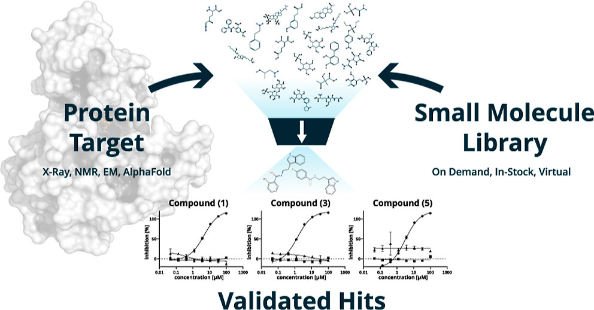

+++
title = "Preferential Multi-Objective Bayesian Optimization for Drug Discovery"
date = "2025-01-01"
outputs = ["Reveal"]
math=true
codeFences = true

+++

<div style="text-align: left;">
  <h3 style="font-size: 1.6em;">Preferential Multi-Objective Bayesian Optimization for Drug Discovery</h3>
</div>

<p style="font-size: 45px;text-align: center;">
Tai Dang
</p>
<p style="font-size: 30px;text-align: center;">
RHF.AI & Stanford University
</p>

---


<div style="text-align: left;">
  <h3 style="font-size: 1.6em;">Preferential Multi-Objective Bayesian Optimization for Drug Discovery</h3>
</div>

<figure style="display: flex; flex-direction: column; align-items: center; width: 60%; margin-top: 0px; margin-left: 220px">


---

### Outline
- Problem Setup
- Preference Elicitation from Pairwise Comparisons
- Benchmarking Docking Models
- Chemist-guided Active Virtual Screening


---

### 1.Problem Setup
For **a given protein** linked to a certain disease,
{}the goal of virtual screening is to select a **few** small molecules (i.e., ligand){}
{}from a library of **millions** candidates{}
{}such that the selected candidate will have the **highest utility** in disease treating.{}

<figure style="display: flex; flex-direction: column; align-items: center; width: 50%; margin-top: 0px; margin-left: 300px">

<figcaption style="text-align: center; font-size: 24px; margin-top: 0px;">
    Virtual Screening Process
    <span style="font-size: 21px;"><a href="https://pubs.acs.org/doi/full/10.1021/acs.jmedchem.3c00128">(Anastasiia, et al., 2023)</a></span>
</figcaption>

---

### 1.Overview: Challenges in Virtual Screening
<p><b>Problem:</b> Large-scale virtual screening is computationally expensive.</p> <ul> 
<li class="fragment"><b>Computational Waste:</b> Exhaustive docking wastes resources on low-quality hits.</li> 
<li class="fragment"><b>Manual Hit Selection:</b> Slow, labor-intensive evaluation by chemists.</li> 
<li class="fragment"><b>Single-Objective Focus:</b> Prioritizing affinity ignores other critical properties.</li> 
<li class="fragment"><b>Result:</b> Wasted effort on unsuitable candidates.</li></ul>
<p class="fragment"><b>→ Need: A more efficient, expert-informed, multi-objective approach.</b></p>


---

### 1.Our Solution: Chemist-Guided Active Screening
**Core Idea**: Leverage **Preferential Multi-Objective Bayesian Optimization**.
<p class="fragment"><b>Key Innovation:</b> Guide the optimization using chemists’ intuition</p> <ul> 
<li class="fragment">Manually weighting multiple objectives is difficult & subjective.</li> 
<li class="fragment">Instead, we learn the expert's preferred trade-offs from simple pairwise choices ('Is Ligand A generally preferable to Ligand B?').</li></ul>
{}**Goal**: Prioritize **high-potential ligands** early, considering multiple objectives simultaneously, guided by expert knowledge.{}


---

### Outline
- <span style="opacity: 0.5;">Problem Setup</span>
- Preference Elicitation from Pairwise Comparisons
- <span style="opacity: 0.5;">Benchmarking Docking Models</span>
- <span style="opacity: 0.5;">Chemist-guided Active Virtual Screening</span>


---

### 2.Preference Elicitation from Pairwise Comparisons
{}
**Problem:**  Traditional virtual screening prioritizes binding affinity but ignores other key drug properties (e.g., toxicity, solubility), making hit selection inefficient.  
{}

{}
**Solution:**  Leverage preference learning to model expert intuition, capturing trade-offs between multiple ligand properties through pairwise comparisons.  
{}

---

### 2.Preference Elicitation from Pairwise Comparisons
Learning a preference model from binary data is equivalent to training a classifier.

{}Given two ligands $\ell_1$ and $\ell_2$ with properties $x_{\ell_1}$ and $x_{\ell_2}$ (e.g., affinity, toxicity, solubility), we model their preference as:{}

{}
```math
p(\ell_1 \succ \ell_2 \mid x_{\ell_1}, x_{\ell_2}) = \frac{e^{f(x_{\ell_1})}}{e^{f(x_{\ell_1})} + e^{f(x_{\ell_2})}}
```
{}

{}
```math
= \frac{1}{1 + e^{-[f(x_{\ell_1}) - f(x_{\ell_2})]}}
```
{}

{}
```math
= \sigma(f(x_{\ell_1}) - f(x_{\ell_2}))
```
{}

{}where $\sigma(\cdot)$ is the sigmoid function, mapping the difference in ligand scores to a preference probability.{}


---

### 2.Preference Elicitation from Pairwise Comparisons
{}
**Approach:**  We train a preference model using ligand properties (binding affinity, lipophilicity, molecular weight, half-life) as input. The utility function $f$ is modeled using a pairwise **Gaussian Process**.  
{}

{}
**Synthetic:**  Generate 1,200 pairwise comparisons using synthetic functions
{}

{}
**Human:** Experts rank ligands given a protein, generating pairwise comparisons.
{}

{}
**Evaluation:**  
<li> 80/20 train-test split with 20-fold cross-validation. </li>
<li> Metrics: Accuracy and ROC AUC. </li>
{}

---

### 2.Preference Elicitation from Pairwise Comparisons

</figcaption> 

{}
<div style="border: 2px solid #333; background-color: rgb(255, 203, 208); padding: 12px; margin-top: 15px; width: calc(100% - 400px); margin-left: 190px; text-align: center; font-size: 0.8em; font-weight: bold; border-radius: 15px;">
Preferential learning robustly recovers the latent utility function with high accuracy and AUC on both synthetic and human data.
</div>
{}

---

### Outline
- <span style="opacity: 0.5;">Problem Setup</span>
- <span style="opacity: 0.5;">Preference Elicitation from Pairwise Comparisons</span>
- Benchmarking Docking Models
- <span style="opacity: 0.5;">Chemist-guided Active Virtual Screening</span>


---

### 3.Benchmarking Docking Models
{}
**Problem:** While traditional docking tools like Vina (especially GPU-accelerated versions) are already fast, it's unclear how newer diffusion-based docking models compare in speed and accuracy.
{}

{}
**Solution:** Benchmark our diffusion-based docking models against Vina to evaluate performance, runtime, and flexibility in modeling ligand conformations.
{}


---

### 3.Diffusion Model: Why used for docking?
Why Use Diffusion Models for Molecules?

{}
<figure style="display: flex; flex-direction: column; align-items: center; width: 100%; margin-top: 0px;">
  
  <figcaption style="text-align: center; font-size: 24px; margin-top: 0px;">From random points to a structured 3D molecule.</figcaption>
</figure>
{}

---

### 3.Diffusion Model: Training Data
{}
The PDB database is limited:
- Contains only ~17,000 protein-ligand pairs.
- Features around 5,000 unique proteins.
{}

{}
For robust diffusion model training, millions of diverse data points are needed. Data augmentation enhances:
- **Ligand Diversity**: Broader chemical structure and property range.
- **Protein Diversity**: Wider variety of binding sites for better model generalization.
{}

{}
Data augmentation techniques create a richer dataset, boosting model performance.
{}


---

### 3.Diffusion Model: Training Data
{}
**Data Augmentation Techniques**:
<ul style="font-size: 26px"> 
    <li class="fragment"><b>Molecular Dynamics:</b> Employed 59,330 dynamic frames of 14,387 protein-ligand complexes to model ligand flexibility, amounting to 75K training data.</li> 
    <li class="fragment"><b>Data Crawling:</b> Curated 322K protein-ligand complexes, yielding 80K unique proteins.</li>
    <li class="fragment"><b>Pharmacophore Alignment:</b> Generated up to 11M pharmacophore-consistent ligand pairs, significantly expanding the ligand training data.</li> 
</ul> 
{}

{}
<div style="display: flex; justify-content: space-between; margin-top: 20px;">
    <div style="width: 49%;">
        
        <p style="text-align: center; font-size: 20px; margin-left: -130px; margin-top: -40px;">
          Figure 1: MD Simulation Trajectories  
          (<a href="https://www.deshawresearch.com/" target="_blank" style="color: #007bff; text-decoration: none;">Source</a>)
        </p>
    </div>
    <div style="width: 23%; margin-top: -45px; margin-right: 180px; white-space: nowrap;">
        
        <p style="text-align: center; font-size: 20px; margin-top: -30px: ellipsis; margin-top: -30px; margin-left: -60px">
            Figure 2: Pharmacophore Modeling  
            (<a href="https://www.researchgate.net/figure/Example-of-a-shared-feature-pharmacophore-model-that-was-generated-by-LigandScout-21_fig1_251702792" target="_blank" style="color: #007bff; text-decoration: none;">Source</a>)
        </p>
    </div>
</div>
{}

---

### 3.Diffusion Model: Results
**Benchmark on Posebusters Dataset**: released post-2021 in PDB. Performance: % of ligand pairs with RMSD < 2 Å in pocket alignment.
Most diffusion models optimize for RMSD, but RMSD only measures geometric similarity.
{}
**Why RMSD Falls Short**: Low RMSD (<2Å) can still cause steric clashes and fails to capture a ligand’s regulatory potential.
{}

{}
<div style="display: flex; justify-content: center; align-items: center; gap: 20px; margin-top: -10px;">
  
  
</div>
{}

---

### 3.Docking Efficiency Benchmark on EGFR
<ul style="font-size: 0.9em;"> 
  <li class="fragment"><b>Traditional Tools</b> (e.g., Vina, Smina): ~1.5s per pose</li> 
  <li class="fragment"><b>Chai</b> (AlphaFold3-like): ~1.5 min for 5 pose</li> 
  <li class="fragment"><b>Our Diffusion Model</b>: ~10s for 128 poses</li> 
</ul>

{}
<div style="display: flex; justify-content: center; align-items: center; gap: 20px; margin-top: -10px;">
  
  
</div>
{}

{}
<div style="border: 2px solid #333; background-color: rgb(255, 203, 208); padding: 12px; margin-top: -15px; width: calc(100% - 300px); margin-left: 150px; text-align: center; font-size: 0.8em; font-weight: bold; border-radius: 15px;">
Key: Diffusion models show promise in binding affinity prediction, though physics-based methods demonstrate greater efficiency and accuracy.
</div>
{}


---

### Outline
- <span style="opacity: 0.5;">Problem Setup</span>
- <span style="opacity: 0.5;">Preference Elicitation from Pairwise Comparisons</span>
- <span style="opacity: 0.5;">Benchmarking Docking Models</span>
- Chemist-guided Active Virtual Screening

---

### 4.CheapVS
{}These implicit expert knowledge, encoded as preferences over ligands, are valuable to elicit for effective virtual screening.{}
{}We can leverage toolkits from the field of machine learning from human preferences to tackle this challenge.{}
<span class="fragment">
<table style="width: 90%; margin-top: 20px; border-collapse: collapse; text-align: center; font-size: 24px;">
  <tr>
    <th style="border: 1px solid #ddd; padding: 8px;">First ligand</th>
    <th style="border: 1px solid #ddd; padding: 8px;">Second ligand</th>
    <th style="border: 1px solid #ddd; padding: 8px;">Preference $(x_1 \succ x_2)$</th>
  </tr>
  <tr>
    <td style="border: 1px solid #ddd; padding: 8px;">[-7.81, 113.38, 0.51]</td>
    <td style="border: 1px solid #ddd; padding: 8px;">[-8.12, 116.28, 0.47]</td>
    <td style="border: 1px solid #ddd; padding: 8px;">0</td>
  </tr>
  <tr>
    <td style="border: 1px solid #ddd; padding: 8px;">[-10.45, 186.17, 0.29]</td>
    <td style="border: 1px solid #ddd; padding: 8px;">[-8.12, 116.28, 0.47]</td>
    <td style="border: 1px solid #ddd; padding: 8px;">1</td>
  </tr>
  <tr>
    <td style="border: 1px solid #ddd; padding: 8px;">[-6.18, 35.32, 0.83]</td>
    <td style="border: 1px solid #ddd; padding: 8px;">[-8.12, 116.28, 0.47]</td>
    <td style="border: 1px solid #ddd; padding: 8px;">0</td>
  </tr>
</table>
<p style="font-size: 24px; text-align: center; margin-top: 15px;">
  <em>Each ligand is represented by a set of features, such as affinity, polar surface area, QED drug-likeness score</em>
</p>
</span>


---

### 4.CheapVS: Algorithm
<div style="display: flex; align-items: flex-start; justify-content: center; gap: 10px;">
  <!-- Text Section -->
  <div style="flex: 1; font-size: 0.75em;">
    <p><b>CheapVS Loop:</b></p> 
    <ul> 
      <li class="fragment"><b>Select</b>: Choose informative ligands (Acquisition Function).</li>
      <li class="fragment"><b>Predict</b>: Get docking scores (affinity).</li>
      <li class="fragment"><b>Feedback</b>: Obtain Chemist's pairwise preferences.</li>
      <li class="fragment"><b>Learn</b>: Update multi-objective utility (GP) from preferences.</li>
      <li class="fragment"><b>Guide Selection</b>: Updated utility informs the next acquisition step.</li>
    </ul>
    <p class="fragment"><b>Output</b>: Top compounds based on learned utility.</p>
  </div>

  <!-- Image Section -->
  <div style="flex: 1.8; text-align: center;">
    
  </div>
</div>


---

### 4.CheapVS: App for Chemist

</figcaption> 

---

### 4.CheapVS: Experiment Setup
<p><b>Experiments on EGFR and DRD2.</b>
</p>
  <ul>
    <li class="fragment">Screening library: 100K molecules.</li>
    <li class="fragment">37 and 58 FDA-approved or late-stage drugs as goal-optimal molecules.</li>
    <li class="fragment">Expert-labeled preferences for multi-objective optimization.</li>
    <li class="fragment">Multi Objectives: 4 for EGFR, 5 for DRD2.</li>
    <li class="fragment">BO samples 1%, adds 0.5% per iteration (10 iterations, 6% total).</li>
  </ul>
</section>


---

### 4.CheapVS: Target’s objectives
<div style="display: flex; justify-content: center; align-items: center; gap: 20px; margin-top: -10px;">
  
  
</div>


---

### 4.CheapVS: Results

</figcaption> 

{}
<div style="border: 2px solid #333; background-color: rgb(255, 203, 208); padding: 12px; margin-top: 15px; width: calc(100% - 280px); margin-left: 150px; text-align: center; font-size: 0.8em; font-weight: bold; border-radius: 15px;">
Key: Incorporating expert preferences outperforms affinity-only methods, emphasizing the critical role of chemical intuition in drug discovery.
</div>
{}


---

### 4. CheapVS: GP Elicitation

<figcaption style="text-align: left; font-size: 23.5px; margin-top: 10px;">Predictive utility scores after BO on expert preference elicitation. The box plot contrasts drugs vs. non-drugs, while heatmaps show utility across two objectives. Results align with medicinal chemistry ranges.


---

### 4.CheapVS: Multi-Objective Trade-Off
{}Single-objective fails to capture trade-offs in drug discovery. Understanding how ligand properties interact helps us model expert preferences more accurately.{}

{}**Approach:** Model interactions between continuous ligand properties using linear regression, incorporating higher-order terms to capture complex dependencies.
```math
y = x_1w_1 + x_2w_2 + x_1x_2w_3
```
where  $y$ is the utility score, and $x_1$, $x_2$ are ligand properties.{}

{}**Hypothesis:** Higher-order interactions improve prediction performance by capturing complex dependencies among ligand properties.
{}

---

### 4.CheapVS: Multi-Objective Trade-Off Results

{}<b>Key Finding:</b>
<li class="fragment"> Higher-order interactions enhance performance by capturing interdependencies. </li>  
<li class="fragment"> GPs model these dependencies, eliminating explicit interaction terms. </li>  
{}

---

### 5. Q&A and Thank you for listening!
- For more details, please check out this paper on<a href="https://www.arxiv.org/abs/2503.16841" target="_blank"> arXiv</a> or scan this QR code

<div style="text-align: center; margin-top: 20px;">
  
</div>