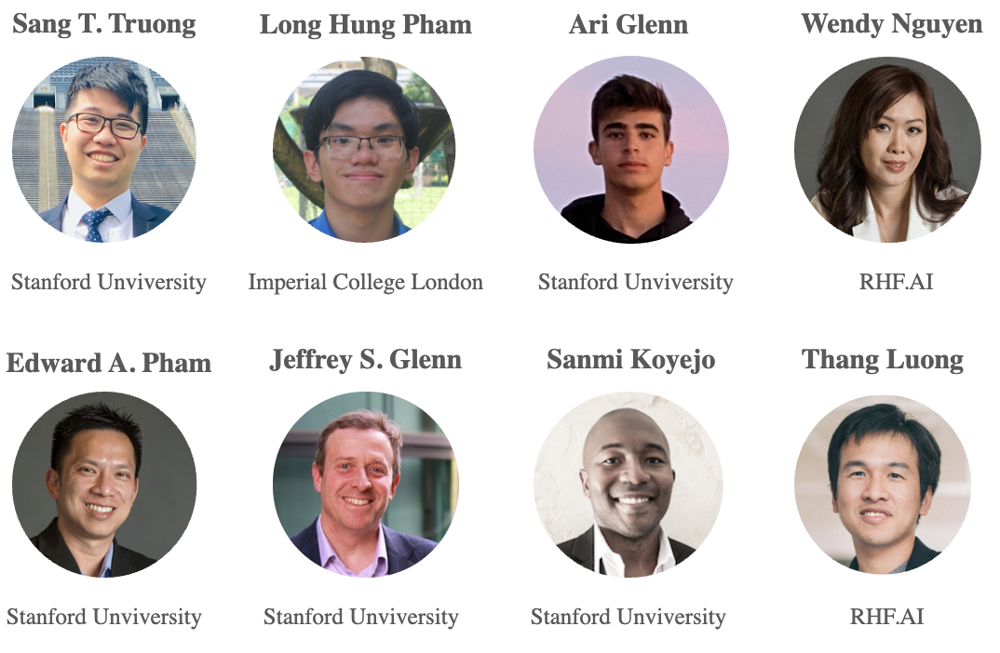
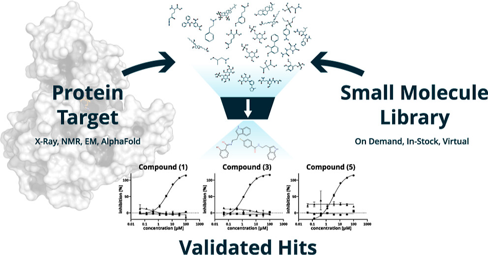
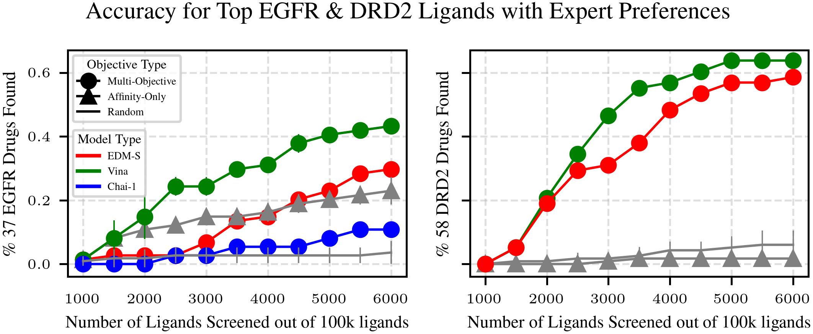
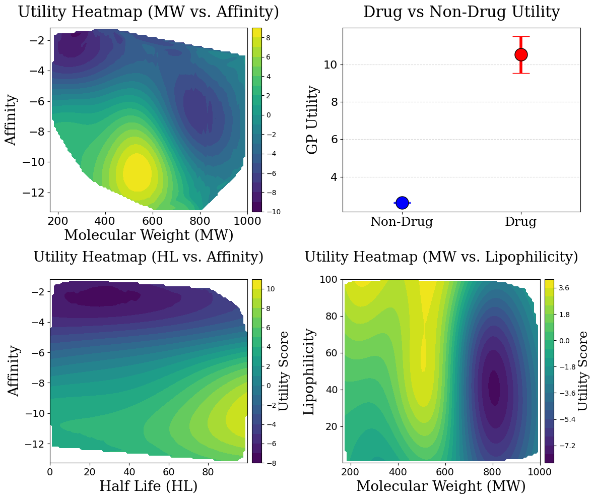
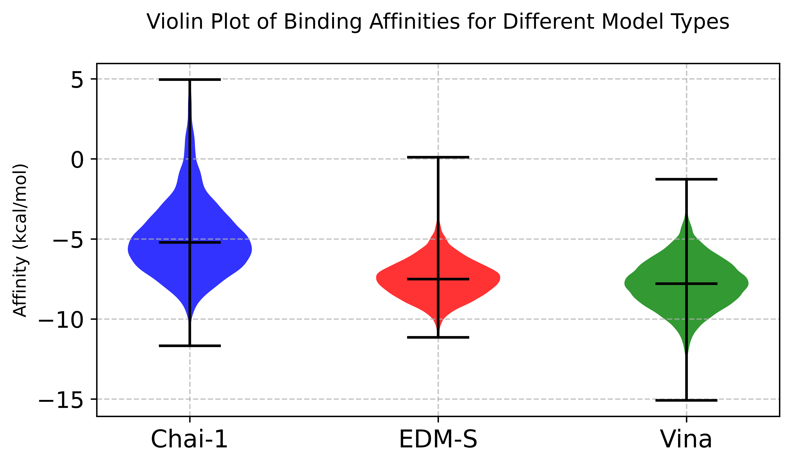
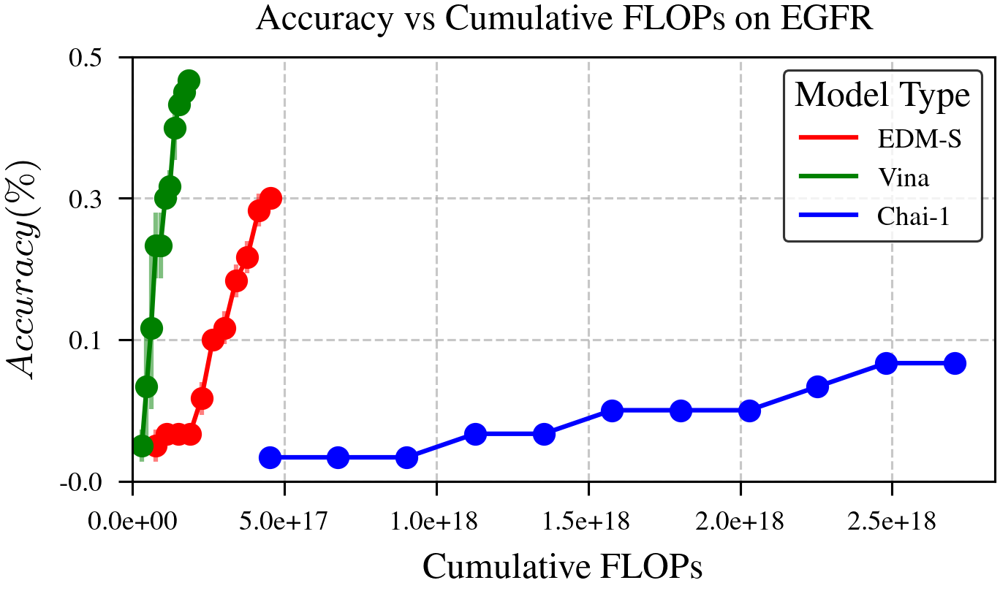

+++
title = "Preferential Multi-Objective Bayesian Optimization for Drug Discovery"
date = "2025-01-01"
outputs = ["Reveal"]
math=true
codeFences = true

+++


  <h3 style="font-size: 1.6em;">Preferential Multi-Objective Bayesian Optimization for Drug Discovery</h3>

Tai Dang

RHF.AI & Stanford University

---


  <h3 style="font-size: 1.6em;">Preferential Multi-Objective Bayesian Optimization for Drug Discovery</h3>

<figure style="display: flex; flex-direction: column; align-items: center; width: 60%; margin-top: 0px; margin-left: 220px">

---

### 1. Problem Setup
For **a given protein** linked to a certain disease,
{}the goal of virtual screening is to select a **few** small molecules (i.e., ligand){}
{}from a library of **millions** candidates{}
{}such that the selected candidate will have the **highest utility** in disease treating.{}

<figure style="display: flex; flex-direction: column; align-items: center; width: 50%; margin-top: 0px; margin-left: 300px">

<figcaption style="text-align: center; font-size: 24px; margin-top: 0px;">
    Virtual Screening Process
    <a href="https://pubs.acs.org/doi/full/10.1021/acs.jmedchem.3c00128">(Anastasiia, et al., 2023)</a>
</figcaption>

---

### Overview: Challenges in Virtual Screening

<b>Problem:</b> Large-scale virtual screening is computationally expensive.
 <ul> 
<li class="fragment"><b>Computational Waste:</b> Exhaustive docking wastes resources on low-quality hits.</li> 
<li class="fragment"><b>Manual Hit Selection:</b> Slow, labor-intensive evaluation by chemists.</li> 
<li class="fragment"><b>Single-Objective Focus:</b> Prioritizing affinity ignores other critical properties.</li> 
<li class="fragment"><b>Result:</b> Wasted effort on unsuitable candidates.</li></ul>

<b>→ Need: A more efficient, expert-informed, multi-objective approach.</b>

---

### 1 Our Solution: Chemist-Guided Active Screening
**Core Idea**: Leverage **Preferential Multi-Objective Bayesian Optimization**.

<b>Key Innovation:</b> Guide the optimization using chemists’ intuition
 <ul> 
<li class="fragment">Manually weighting multiple objectives is difficult & subjective.</li> 
<li class="fragment">Instead, we learn the expert's preferred trade-offs from simple pairwise choices ('Is Ligand A generally preferable to Ligand B?').</li></ul>
{}**Goal**: Prioritize **high-potential ligands** early, considering multiple objectives simultaneously, guided by expert knowledge.{}

---

### 2.CheapVS: Algorithm

  <!-- Text Section -->
  

    
<b>CheapVS Loop:</b>
 
    <ul> 
      <li class="fragment"><b>Select</b>: Choose informative ligands (Acquisition Function).</li>
      <li class="fragment"><b>Predict</b>: Get docking scores (affinity).</li>
      <li class="fragment"><b>Feedback</b>: Obtain Chemist's pairwise preferences.</li>
      <li class="fragment"><b>Learn</b>: Update multi-objective utility (GP) from preferences.</li>
      <li class="fragment"><b>Guide Selection</b>: Updated utility informs the next acquisition step.</li>
    </ul>
    
<b>Output</b>: Top compounds based on learned utility.

  

  <!-- Image Section -->
  

    
  

---

### 2.CheapVS: Experiment Setup

<b>Experiments on EGFR and DRD2.</b>

  <ul>
    <li class="fragment">Screening library: 100K molecules.</li>
    <li class="fragment">37 and 58 FDA-approved or late-stage drugs as goal-optimal molecules.</li>
    <li class="fragment">Expert-labeled preferences for multi-objective optimization.</li>
    <li class="fragment">Multi Objectives: 4 for EGFR, 5 for DRD2.</li>
    <li class="fragment">BO samples 1%, adds 0.5% per iteration (10 iterations, 6% total).</li>
  </ul>
</section>

---

### 2.CheapVS: Results

</figcaption> 

{}

Key: Incorporating expert preferences outperforms affinity-only methods, emphasizing the critical role of chemical intuition in drug discovery.

{}

---

### 2. CheapVS: GP Elicitation

<figcaption style="text-align: left; font-size: 23.5px; margin-top: 10px;">Predictive utility scores after BO on expert preference elicitation. The box plot contrasts drugs vs. non-drugs, while heatmaps show utility across two objectives. Results align with medicinal chemistry ranges.

---

### 3. Docking Efficiency Benchmark on EGFR
<ul style="font-size: 0.9em;"> 
  <li class="fragment"><b>Traditional Tools</b> (e.g., Vina, Smina): ~1.5s per pose</li> 
  <li class="fragment"><b>Chai</b> (AlphaFold3-like): ~1.5 min for 5 pose</li> 
  <li class="fragment"><b>Our Diffusion Model</b>: ~10s for 128 poses</li> 
</ul>

{}

  
  

{}

{}

Key: Diffusion models show promise in binding affinity prediction, though physics-based methods demonstrate greater efficiency and accuracy.

{}

---

### 4. Thank you for listening!
- For more details, please check out this paper on<a href="https://www.arxiv.org/abs/2503.16841" target="_blank"> arXiv</a> or scan this QR code
- Come speak to me at the poster section.

  

