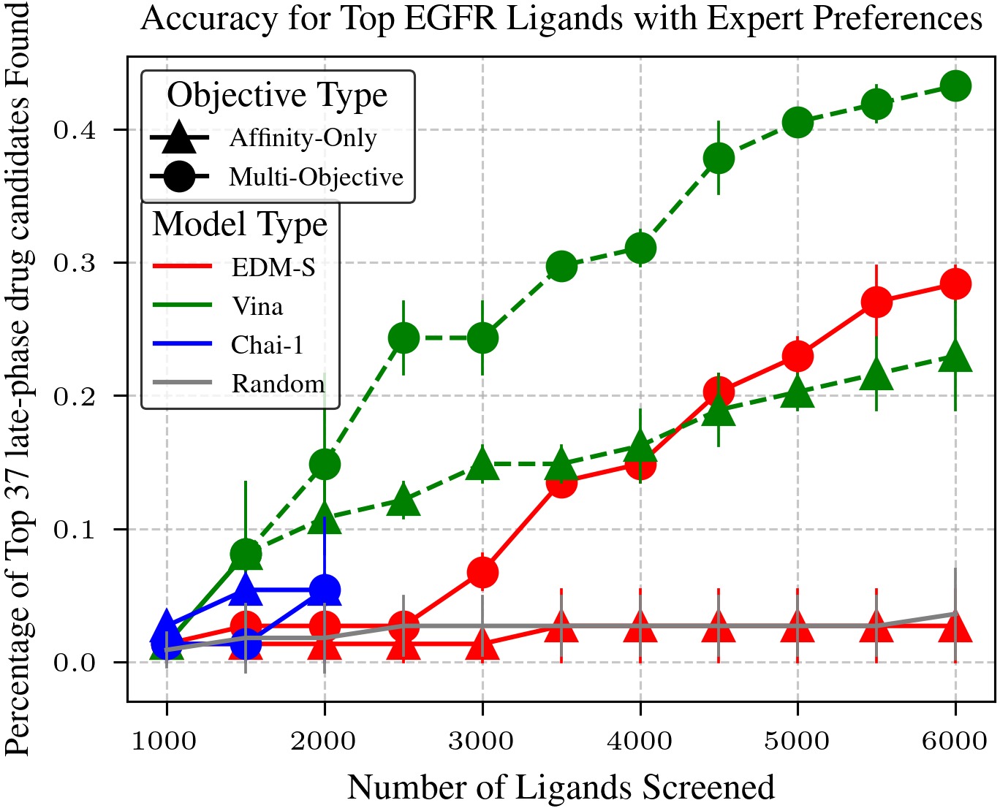
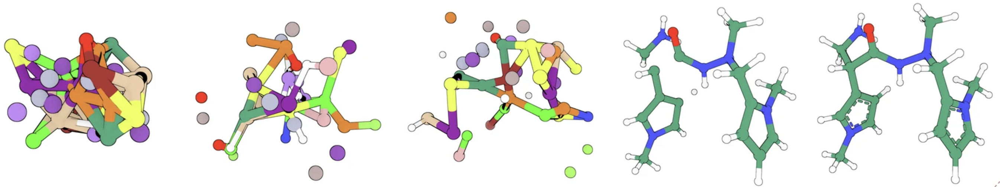

+++
title = "Preferential Multi-Objective Bayesian Optimization for Drug Discovery"
date = "2025-01-01"
outputs = ["Reveal"]
math=true
codeFences = true

+++

<div style="text-align: left;">
  <h3 style="font-size: 1.5em;">Preferential Multi-Objective Bayesian Optimization for Drug Discovery</h3>
</div>

<p style="font-size: 30px;">
Tai Dang<sup>1,2</sup>,Hung Pham<sup>3</sup>,Sang Truong<sup>2</sup>, Ari Glenn<sup>2</sup>, Wendy Nguyen<sup>1</sup>, Edward A Pham<sup>2</sup>, Jeffrey S. Glenn<sup>2</sup>, Sanmi Koyejo<sup>2</sup>, Thang Luong<sup>1</sup> 
</p>
<p style="font-size: 30px;">
<sup>1</sup>RHF.AI, <sup>2</sup>Stanford University, <sup>3</sup>Imperial College London
</p>

<div style="display: flex; justify-content: space-between; width: 30%;">
  
   
  
</div>

---

### Outline
- Problem Setup
- Virtual Screening on Synthetic Functions
- Chemist-guided Active Preferential Virtual Screening
- Protein-ligand docking with Diffusion Models


---

### Overview: Problem setup
Traditional large-scale docking consumes extensive computational resources, making the process slow and costly. 
{}Chemists manually evaluate thousands of molecules, selecting hits based on intuition. {}
{}This step is critical yet slow, forming a major bottleneck.{}{}Experts must balance multiple drug properties (e.g., efficacy, safety, solubility),{}
{}complicating decision-making and extending timelines in drug development.{}


---

### Overview: End-to-End Pipeline
A Unified Workflow for Efficient Virtual Screening

<div style="display: flex; justify-content: center; align-items: center; margin-top: 0.5em; gap: 0.5em; flex-wrap: nowrap;">
  <div style="text-align: center; width: 18%;">
    <p style="font-size: 0.9em; margin-bottom: 0.2em;"><strong>1. Input</strong></p>
    <p style="font-size: 0.8em; margin-bottom: 0.3em;">Ligand library</p>
  </div>
  <div style="font-size: 1.2em;">&rarr;</div>

  <div style="text-align: center; width: 22%;">
    <p style="font-size: 0.8em; margin-bottom: 0.2em;"><strong>2. Docking Module</strong></p>
    <p style="font-size: 0.8em; margin-bottom: 0.3em;">Diffusion-based Docking</p>
  </div>
  <div style="font-size: 1.2em;">&rarr;</div>
  
  <div style="text-align: center; width: 22%;">
    <p style="font-size: 0.9em; margin-bottom: 0.2em;"><strong>3. Active Preference Model</strong></p>
    <p style="font-size: 0.8em; margin-bottom: 0.3em;">BO + Chemist Feedback</p>
  </div>
  <div style="font-size: 1.2em;">&rarr;</div>

  <div style="text-align: center; width: 18%;">
    <p style="font-size: 0.9em; margin-bottom: 0.2em;"><strong>4. Decision</strong></p>
    <p style="font-size: 0.8em; margin-bottom: 0.3em;">Top Candidates</p>
  </div>
</div>


---

### Overview
<section>
  <figure style="text-align: center; margin-top: 100px; position: relative;">
    
    <div style="position: absolute; top: 0; left: 29.5%; width: 70%; height: 100%; background: white;" class="fragment fade-out"></div>
    <div style="position: absolute; bottom: 0; left: 0; width: 100%; height: 56%; background: white;" class="fragment fade-out"></div>
    <div style="position: absolute; bottom: 0; left: 0; width: 45.9%; height: 55%; background: white;"></div>
  </figure>

  <figure style="text-align: center; margin-top: -579px; position: relative;" class="fragment fade-in">
    
    <div style="position: absolute; bottom: 0; left: 0; width: 38%; height: 55%; background: white;" class="fragment fade-out"></div>
  </figure>
</section>

---

### Overview: Streamlining Virtual Screening with Advanced Techniques

<div style="margin-top: 20px; display: flex; justify-content: space-between; align-items: flex-start;">
  <div style="width: 50%;">
    <h3 style="font-size: 36px;">Challenges:</h3>
    <ol style="font-size: 32px;">
      <li class="fragment" data-fragment-index="1">Conducting virtual screening within budget constraints.</li>
      <li class="fragment" data-fragment-index="2">Incorporating multiple objectives beyond affinity.</li>
      <li class="fragment" data-fragment-index="3">Training efficient docking models with limited resources.</li>
    </ol>
  </div>

  <div style="width: 50%;">
    <h3 style="font-size: 36px; padding-left: 30px;">Solutions:</h3>
    <ol style="font-size: 32px; padding-left: 30px;">
      <li class="fragment" data-fragment-index="1">Optimize ligand selection through active screening.</li>
      <li class="fragment" data-fragment-index="2">Utilize Preferential Multi-Objective Bayesian Optimization.</li>
      <li class="fragment" data-fragment-index="3">Enhance docking model through diffusion model.</li>
    </ol>
  </div>
</div>


---

### Outline
- Problem Setup
- <span style="opacity: 0.5;">Virtual Screening on Synthetic Functions</span>
- <span style="opacity: 0.5;">Chemist-guided Active Preferential Virtual Screening</span>
- <span style="opacity: 0.5;">Protein-ligand docking with Diffusion Models</span>


---

### 1. Problem Setup
For **a given protein** linked to a certain disease,
{}the goal of virtual screening is to select a **few** small molecules (i.e., ligand){}
{}from a library of **millions** candidates{}
{}such that the selected candidate will have the **highest utility** in disease treating.{}

{}
<figure style="display: flex; flex-direction: column; align-items: center; width: 90%; margin-top: 0px; margin-left: 60px">

<figcaption style="text-align: center; font-size: 24px; margin-top: 0px;">
    Traditional Virtual Screening Process
    <span style="font-size: 22px;"><a href="https://pmc.ncbi.nlm.nih.gov/articles/PMC8188596/">(Graff et al., 2021)</a></span>
</figcaption>
{}


---

### 1. Problem Setup
{}Docking consumes vast computational resources on low-scoring compounds, though only top-ranked molecules advance for validation.{}
{}To refine this process, virtual screening includes <b>hit identification</b>, where chemists select promising compounds based on ligand properties.{}

{}Even with expert-defined trade-offs, exhaustively screening millions of candidates is infeasible.{}
{}To address this, we prioritize promising ligands while avoiding those likely to be poor candidates.{}  

---

### 1. Problem Setup
{}To prioritize high-potential ligands, we use **Preferential Bayesian Optimization**,{}
{}an approach that balances exploring new candidates and exploiting known promising ones to efficiently find optimal solutions.{}
  
{}

<figcaption style="text-align: center; font-size: 24px; margin-top: 20px;">
    Active Virtual Screening Process
    <span style="font-size: 22px;"><a href="https://openreview.net/pdf?id=7d7Gpiyc2TU">(Graff et al., 2021)</a></span>
</figcaption>
{}

---

### 1. Problem Setup
Learning a preference model from binary preference data can be viewed as learning a classifier. 

  {}
  ```math
  p(y \mid x_1, x_2; f) = \frac{e^{f(x_1)}}{e^{f(x_1)} + e^{f(x_2)}}
  ```
  {}

  {}
  ```math
  = \frac{1}{1 + e^{-[f(x_1)-f(x_2)]}}
  ```
  {}

  {}
  ```math
  = \sigma(f(x_1)-f(x_2))
  ```
  {}

{}where $\sigma(\cdot)$ is the sigmoid function.{}

---

### 1. Problem Setup
<p><b>Goal:</b> Identify the top <i>k</i> candidate ligands for a given protein from a library.</p>
<li class="fragment"><b>Step 1:</b> Start with a ligand library $\mathcal{L} = \{ l_1, \dots, l_N \}$ and a empty dataset $\mathcal{D}$.  </li>
<li class="fragment"><b>Step 2:</b> Select a subset $\mathcal{D}_i = \{ l_i, l_k, l_f, \dots \}$  using an acquisition function $\alpha$, update the dataset $\mathcal{D} \leftarrow \mathcal{D} \cup \mathcal{D}_i$
  and remove these ligands from $\mathcal{L} \leftarrow \mathcal{L} \setminus \mathcal{D}_i$.
</li>
<li class="fragment"><b>Step 3:</b> Dock ligands in $\mathcal{D}_i$ using a docking model $\theta$ to estimate binding affinity.</li>
<li class="fragment"><b>Step 4:</b> Train a GP $g$ on ligand fingerprints $t$ to predict affinity: $ g(t) \sim \mathcal{GP}(\mu, k) $
</li>
<li class="fragment"><b>Step 5:</b> Compute additional ligand properties (e.g., solubility, toxicity).</li>
<li class="fragment"><b>Step 6:</b> Train a GP $f$ with pairwise preferences from ligand properties:  
  $$ f(\mathbf{x}) \sim \mathcal{GP}(\mu, k) \quad \text{and} \quad p(y=1 \mid \mathbf{x}_1, \mathbf{x}_2) = \sigma(f(\mathbf{x}_1) - f(\mathbf{x}_2)) $$
</li>
<li class="fragment"><b>Step 7:</b> Return to Step 2 or terminate if the computational budget is reached.</li>

---

### Overview
<figure style="text-align: center; margin-top: 0px; position: relative;" class="fragment fade-in">
  
</figure>

---

### Outline
- <span style="opacity: 0.5;">Problem Setup</span>
- Virtual Screening on Synthetic Functions
- <span style="opacity: 0.5;">Chemist-guided Active Preferential Virtual Screening</span>
- <span style="opacity: 0.5;">Protein-ligand docking with Diffusion Models</span>


---

### 2. Virtual Screening on Synthetic Functions
{}
**Problem:** We need to validate our Bayesian Optimization approach in a controlled setting before using real-world molecules.
{}

{}
**Solution:** Synthetic benchmarks let us systematically measure convergence and exploration-exploitation balance.
{}

{}
**How This Fits In:** This step verifies the core optimization engine before we bring in real chemists.
{}

---

### 2. Active Virtual Screening: Experiment Setup
Synthetic Utility Landscapes
<ul>
  <li class="fragment">Testing synthetic functions helps refine the approach before human experiments.</li>
  <li class="fragment">Benchmarks: Ackley, Alpine1, Hartmann, Dropwave, Qeifail, Levy.</li>
  <li class="fragment">Each benchmark outputs a scalar utility for preference-based learning.</li>
  <li class="fragment">Simulated objectives: affinity, rotatable bonds, molecular weight, LogP.</li>
  <li class="fragment">20K-ligand subset used for computational efficiency.</li>
</ul>
{}
<figure style="display: flex; flex-direction: column; align-items: center;">
  <div style="display: flex; justify-content: center; width: 100%; gap: 70px;">
      
  </div>
  <figcaption style="text-align: center; font-size: 20px; margin-top: 0px;">Synthetic functions landscape.</figcaption>
</figure>
{}

---

### 2. Active Virtual Screening: Evaluation Metrics
**Metrics for evaluation** 
{}
**Regret**
{}
<ul>
  <li class="fragment">$R_i = U^* - U(i)$</li>
  <li class="fragment">Where $U^*$ is the highest possible utility in the library and $U(i)$ is the highest utility found by the model at iteration $i$</li>
</ul>

{}
**Percent of Best Ligand Found**
{}

<ul>
  <li class="fragment"><b>Definition</b>: Percentage of screened ligands close in affinity to the best possible ligand. ($top_k \%$)</li>
</ul>

---

### 2. Active Virtual Screening: Screening Results
{}
<figure style="display: flex; flex-direction: column; align-items: center;">
  <div style="display: flex; justify-content: center; width: 95%; gap: 70px;">
      
  </div>
</figure>
{}

{}
<div style="border: 2px solid #333; background-color: rgb(255, 203, 208); padding: 12px; margin-top: 0px; width: calc(100% - 100px); margin-left: 35px; text-align: center; font-size: 0.8em; font-weight: bold; border-radius: 15px;">
Key: Preferential BO effectively learns complex utility landscapes in synthetic benchmarks.
</div>
{}


---

### Outline
- <span style="opacity: 0.5;">Problem Setup</span>
- <span style="opacity: 0.5;">Virtual Screening on Synthetic Functions</span>
- Chemist-guided Active Preferential Virtual Screening
- <span style="opacity: 0.5;">Protein-ligand docking with Diffusion Models</span>


---

### 3. CheapVS: Chemist-guided Active Preferential Virtual Screening Framework
{}
**Problem:** Affinity alone isn’t enough; real chemists balance multiple properties (toxicity, solubility, etc.).
{}

{}
**Solution:** We introduce pairwise preference elicitation to capture expert intuition.
{}

{}
**How This Fits In:** After validating the optimization engine on synthetics, now we incorporate human knowledge to refine the search for real protein targets.
{}


---

### 3.CheapVS
In drug discovery, selecting candidate ligands goes beyond targeting high-affinity molecules.
{}Experts use their deep chemical intuition to balance competing properties such as synthesizability, solubility, and potential side effects. {}
{}This approach ensures ligands are not only effective but also practical and safe for therapeutic use.{}

---

### 3.CheapVS
<p>
  Depending on the disease and target protein, experts have <b>intuition</b> about ligand characteristics,  
  {}balancing synthesizability, affinity, solubility, and side effects.{}  
  {}For instance, bulky functional groups can enhance binding but reduce solubility or increase toxicity, complicating optimization.{}  
</p>


{}
<div style="display: flex; justify-content: center; width: 100%; gap: -30px; margin-top: -100px;">
  <figure style="display: flex; flex-direction: column; align-items: center; width: 45%;">
    
    <figcaption style="text-align: left; font-size: 20px; margin-top: -50px;">Affinity: -10.11, Solubility: 67.66</figcaption>
  </figure>
  <figure style="display: flex; flex-direction: column; align-items: center; width: 45%;">
    
    <figcaption style="text-align: left; font-size: 20px; margin-top: -50px;">Affinity: -6.3, Solubility: 128.37</figcaption>
  </figure>
</div>
{}


---

### 3.CheapVS
{}These implicit expert knowledge, encoded as preferences over ligands, are valuable to elicit for effective virtual screening.{}
{}We can leverage toolkits from the field of machine learning from human preferences to tackle this challenge.{}
<span class="fragment">
<table style="width: 90%; margin-top: 20px; border-collapse: collapse; text-align: center; font-size: 24px;">
  <tr>
    <th style="border: 1px solid #ddd; padding: 8px;">First ligand</th>
    <th style="border: 1px solid #ddd; padding: 8px;">Second ligand</th>
    <th style="border: 1px solid #ddd; padding: 8px;">Preference $(x_1 \succ x_2)$</th>
  </tr>
  <tr>
    <td style="border: 1px solid #ddd; padding: 8px;">[-7.81, 113.38, 0.51]</td>
    <td style="border: 1px solid #ddd; padding: 8px;">[-8.12, 116.28, 0.47]</td>
    <td style="border: 1px solid #ddd; padding: 8px;">0</td>
  </tr>
  <tr>
    <td style="border: 1px solid #ddd; padding: 8px;">[-10.45, 186.17, 0.29]</td>
    <td style="border: 1px solid #ddd; padding: 8px;">[-8.12, 116.28, 0.47]</td>
    <td style="border: 1px solid #ddd; padding: 8px;">1</td>
  </tr>
  <tr>
    <td style="border: 1px solid #ddd; padding: 8px;">[-6.18, 35.32, 0.83]</td>
    <td style="border: 1px solid #ddd; padding: 8px;">[-8.12, 116.28, 0.47]</td>
    <td style="border: 1px solid #ddd; padding: 8px;">0</td>
  </tr>
</table>
<p style="font-size: 24px; text-align: center; margin-top: 15px;">
  <em>Each ligand is represented by a set of features, such as affinity, polar surface area, QED drug-likeness score</em>
</p>
</span>

<!-- ---

### 3.CheapVS

<figcaption style="text-align: center; font-size: 28px; margin-top: 10px;">App for interacting with Chemists.
 -->

---

### 3.CheapVS: Experiment Setup
BO Optimization for EGFR
<p><b>EGFR (Epidermal Growth Factor Receptor)</b> is a protein that regulates cell growth. Mutations in EGFR are linked to cancers.</p>
  <ul>
    <li class="fragment">Screening library: 100K molecules.</li>
    <li class="fragment">37 FDA-approved or late-stage drugs as goal-optimal molecules.</li>
    <li class="fragment">Expert-labeled preferences for multi-objective optimization.</li>
    <li class="fragment">4 Objectives: Affinity, Molecular Weight, Lipophilicity, Half-life.</li>
    <li class="fragment">BO samples 1%, adds 0.5% per iteration (10 iterations, 6% total).</li>
  </ul>
</section>


---

### 3.CheapVS: Results

</figcaption> 

{}
<div style="border: 2px solid #333; background-color: rgb(255, 203, 208); padding: 12px; margin-top: 15px; width: calc(100% - 280px); margin-left: 150px; text-align: center; font-size: 0.8em; font-weight: bold; border-radius: 15px;">
Key: Performance of CheapVS in identifying EGFR drugs. Multi-objective optimization outperforms the rest, identifying up to 16 of 37 approved drugs.
</div>
{}

---

### 3.CheapVS: GP Elicitation

<figcaption style="text-align: left; font-size: 23.5px; margin-top: 10px;">Predictive utility scores after BO on expert preference elicitation. The box plot contrasts drugs vs. non-drugs, while heatmaps show utility across two objectives. Results align with medicinal chemistry ranges.

---

### Outline
- <span style="opacity: 0.5;">Problem Setup</span>
- <span style="opacity: 0.5;">Virtual Screening on Synthetic Functions</span>
- <span style="opacity: 0.5;">Chemist-guided Active Preferential Virtual Screening</span>
- Protein-ligand docking with Diffusion Models

---

### 4. Protein-Ligand Docking with Diffusion Models

{}
**Problem:** Traditional docking tools (Vina) are computationally expensive, slowing down active virtual screening.
{}

{}
**Solution:** A diffusion-based docking model drastically reduces runtime and can handle flexible ligand conformations.
{}

{}
**How This Fits In:** This docking module slots into our iterative loop (active screening + chemist feedback), speeding up each evaluate-and-choose cycle.
{}

---

### 4. Diffusion Model: Noise to pattern
{}**Diffusion models** are a type of machine learning model used to generate data by starting with noise and gradually creating a meaningful pattern.{}

{}
<figure style="display: flex; flex-direction: column; align-items: center; width: 80%; margin-left: 80px;"> 
   
  <figcaption style="text-align: center; font-size: 24px; margin-top: 10px;">Transforming noise into meaningful structures.</figcaption> 
</figure> 
{}

---

### 4. Diffusion Model: Why used for docking?
Why Use Diffusion Models for Molecules?

{}
<figure style="display: flex; flex-direction: column; align-items: center; width: 100%; margin-top: 0px;">
  
  <figcaption style="text-align: center; font-size: 24px; margin-top: 0px;">From random points to a structured 3D molecule.</figcaption>
</figure>
{}

---

### 4. Diffusion Model: Training Data
{}
The PDB database is limited:
- Contains only ~17,000 protein-ligand pairs.
- Features around 5,000 unique proteins.
{}

{}
For robust diffusion model training, millions of diverse data points are needed. Data augmentation enhances:
- **Ligand Diversity**: Broader chemical structure and property range.
- **Protein Diversity**: Wider variety of binding sites for better model generalization.
{}

{}
Data augmentation techniques create a richer dataset, boosting model performance.
{}

---

### 4. Diffusion Model: Training Data
{}
**Data Augmentation Techniques**:
<ul style="font-size: 26px"> 
    <li class="fragment"><b>Molecular Dynamics:</b> Employed 59,330 dynamic frames of 14,387 protein-ligand complexes to model ligand flexibility, amounting to 75K training data.</li> 
    <li class="fragment"><b>Data Crawling:</b> Curated 322K protein-ligand complexes, yielding 80K unique proteins.</li>
    <li class="fragment"><b>Pharmacophore Alignment:</b> Generated up to 11M pharmacophore-consistent ligand pairs, significantly expanding the ligand training data.</li> 
</ul> 
{}

{}
<div style="display: flex; justify-content: space-between; margin-top: 20px;">
    <div style="width: 49%;">
        
        <p style="text-align: center; font-size: 20px; margin-left: -130px; margin-top: -40px;">
          Figure 1: MD Simulation Trajectories  
          (<a href="https://www.deshawresearch.com/" target="_blank" style="color: #007bff; text-decoration: none;">Source</a>)
        </p>
    </div>
    <div style="width: 23%; margin-top: -45px; margin-right: 180px; white-space: nowrap;">
        
        <p style="text-align: center; font-size: 20px; margin-top: -30px: ellipsis; margin-top: -30px; margin-left: -60px">
            Figure 2: Pharmacophore Modeling  
            (<a href="https://www.researchgate.net/figure/Example-of-a-shared-feature-pharmacophore-model-that-was-generated-by-LigandScout-21_fig1_251702792" target="_blank" style="color: #007bff; text-decoration: none;">Source</a>)
        </p>
    </div>
</div>
{}

---

### 4. Diffusion Model: Results
{}
<figure style="text-align: center; margin-top: 0px; position: relative;">
  
  <p style="text-align: left; font-size: 20px; margin-top: 10px;">Box plot of binding affinities (kcal/mol) for different docking models. Vina achieves the lowest median binding affinity, followed by EDM-S, while Chai exhibits the weakest binding.
</p>
</figure>
{}

---

### 4. Diffusion Model: Results
**Benchmark on Posebusters Dataset**:
{}Posebusters: Version 1 (428 structures) and Version 2 (308 structures), released post-2021 in PDB.{}
{}Performance: % of ligand pairs with $RMSD < 2 Å$ in pocket alignment.{}

{}
<figure style="text-align: center; margin-top: -20px; position: relative;">
  
</figure>
{}


---

### 4. Diffusion Model: Neural Search for Docking
<ul style="font-size: 0.9em;"> 
  <li class="fragment"><b>Traditional Tools</b> (e.g., Vina, Smina): ~2mins per pose</li> 
  <li class="fragment"><b>Chai</b> (AlphaFold3-like): ~1.5 mins for 1 pose (1.3x faster)</li> 
  <li class="fragment"><b>Our Diffusion Model</b>: ~25s for 128 poses (4.9x faster)</li> 
</ul>
{}
<figure style="text-align: center; margin-top: -10px; position: relative;">
  
</figure>
{}

{}
<div style="border: 2px solid #333; background-color: rgb(255, 203, 208); padding: 12px; margin-top: -15px; width: calc(100% - 300px); margin-left: 150px; text-align: center; font-size: 0.8em; font-weight: bold; border-radius: 15px;">
Key: EDM-S minimizes regret faster and is significantly more efficient than Chai-1 and Vina, highlighting the power of lightweight docking in VS.
</div>
{}

---

### 5. Conclusion
<ul>
    <li class="fragment"><b>Efficient Drug Discovery:</b> Our framework accelerates VS by leveraging preferential multi-objective BO, requiring only a small subset of ligands and expert pairwise preferences.</li>
    <li class="fragment"><b>Strong Performance:</b> Our algorithm successfully identified 16/37 drugs, significantly outperforming baseline methods, highlighting the power of preference-based optimization.</li>
</ul>

---

### 6. Next steps
<ul> 
  <li class="fragment">Listwise preference for providing richer preference information</li>
  <li class="fragment">Build on top of state-of-the-art models such as AlphaFold3</li> 
</ul>